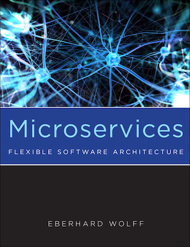

# Microservices

 

A Microservice-based architecture divides software systems into many
small services which can be deployed independently. Every team works
on its own Microservices and is thus decoupled from other teams. This
allows to easily scale agile processes. The modularization into
Microservices protects the system against architecture
decay. Consequently, systems based on Microservices stay maintainable
in the long term. In addition, legacy systems can be migrated to
Microservices without having to change the legacy code. Moreover,
Continuous Delivery is easier to implement in Microservice-based
systems. The book is translated from German, see
<http://microservices-buch.de>. There is also a [Korean
translation](http://acornpub.co.kr/book/microservices).

Eberhard Wolff's book offers a comprehensive introduction to Microservices. It covers:

      
* Advantages and disadvantages of the Microservice approach
* Microservices vs. SOA (Service-oriented Architecture)
* The architecture of Microservice-based systems
* The architecture of individual Microservices
* Impact on project organization, operation, testing and deployment
* Nanoservices
      
The book explains technology-neutral concepts and architectures which
can be implemented with various technologies. As an example a concrete
Java technology stack is shown with Spring Boot, the Netflix stack and
Spring Cloud.

On the basis of many examples and concrete scenarios you will learn
how Microservices can be used as effectively as possible. You will
also get suggestions how to deepen what you have learned through your
own experiments.

The book also contains essays by Microservices experts.
      
## What Readers Say

This is what readers say:

thoroughly enjoying the book "Microservices" by @ewolff of
@innoQ. definitely has a spot on my "must-read" list. <a
href="https://twitter.com/mamund/status/792885629516480513">Mike
Amundsen </a>

This is what readers say about the original German edition of the
book:
      
Surprisingly, the best book on Microservices is in German:
"Microservices" by @ewolff

[Matthias Fritschi](https://twitter.com/matfsw/status/671222544729579520)

For IT topics I usually prefer English literature, but I really
recommend "Continuous Delivery" and "Microservices" by @ewolff.

[Peter Storch](https://twitter.com/storchp/status/678547218119401473)

## Author

Eberhard Wolff has 15+ years of experience as architect and consultant
- often at the intersection of business and technology. He is a Fellow
at innoQ in Germany. He has given talks at international conferences
and written more than 100 articles and books e.g. about Microservices
and Continuous Delivery. His technological focus is on modern
architectures - involving Cloud, Continuous Delivery, DevOps,
Microservices or NoSQL.
