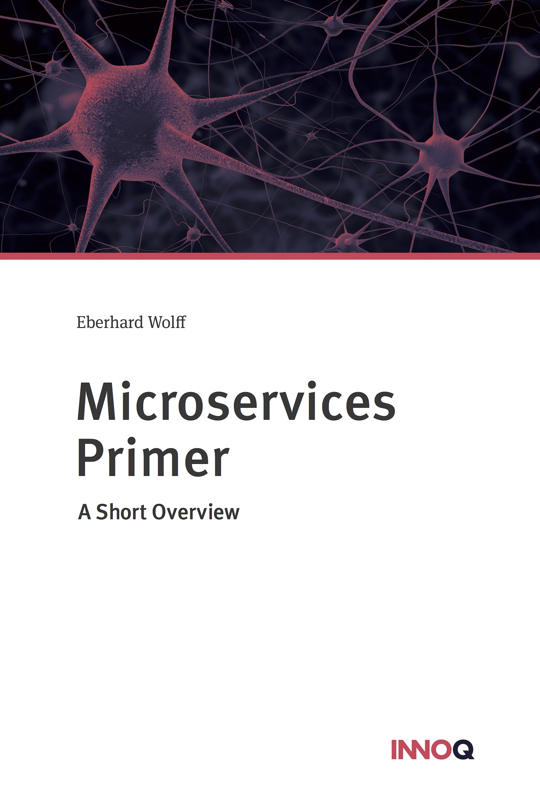

# The FREE Primer

      
The Primer gives a short overview of Microservices. It is free and it
is a great ressource to get started with Microservices.
      

 
      
## How to Get It

You can get the eBook for free from **Leanpub**. You get a PDF, ePub
and Mobi (Kindle). There is no DRM (digital rights management).
      

<https://leanpub.com/microservices-primer>

At **Amazon** the Kindle eBook is not free but quite cheap. Here are
the links to the Amazon web sites:

      
* [Amazon DE](http://amzn.to/1ntnuh0)
* [Amazon COM](http://amzn.to/1OrVtz9)
* [Amazon UK](http://amzn.to/1SYt4Uy)
* [Amazon CA](http://amzn.to/2HMMfzP)
* [Amazon ES](http://amzn.to/2Ckug4r)
* [Amazon FR](http://amzn.to/1ntnOfP)
* [Amazon IT](http://amzn.to/1SYufU2)
      

There is also a printed version:

      
* [Amazon DE](http://amzn.to/2HLKGCp)
* [Amazon COM](http://amzn.to/2HOhV7S)
* [Amazon UK](http://amzn.to/2CJ1aaH)
* [Amazon CA](http://amzn.to/2CJcG5N)
* [Amazon ES](http://amzn.to/2EU4Gkf)
* [Amazon FR](http://amzn.to/2HOtnRc)
* [Amazon IT](http://amzn.to/2HOtE6G)
      

## Content

#### What are Microservices?

      
* Size of Microservies
* Microservices, Domain-driven Design and Bounded Context
* Conway's Law and the impact on the Organization
      
	  
#### Why Microservices?
	  
      
* Scaling Agility
* Migrating Legacy Applications
* Sustainable development
* Robustness
* Continuous Delivery
* Independent scalability
* Technology freedom
      
    
In the last chapter the primer gives hints how to start with
Microservices.
